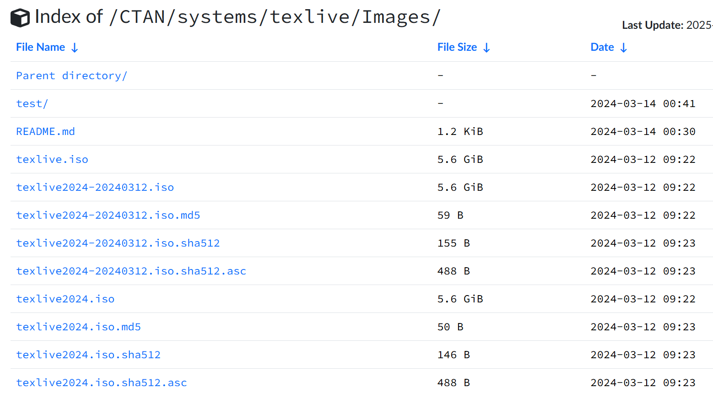

## VS Code使用LaTex

### LaTeX简介
LaTeX 不是通常意义上具有图形化操作界面的软件，而是一种基于 TeX 的排版系统，广泛应用于学术、科研、出版等领域，用于高质量的技术文档、书籍、论文等的排版。
- 学术论文撰写：在数学、物理、计算机科学、工程等各个学术领域，科研人员广泛使用 LaTeX 来撰写学术论文。它能够保证论文的格式规范、公式准确，并且可以方便地与各种学术期刊和会议的模板进行适配。
- 书籍出版：许多专业书籍、教材的排版也会使用 LaTeX。它可以实现对书籍的章节结构、页码编排、索引生成等进行高效管理，能够满足书籍出版对排版质量和规范性的高要求。
- 技术文档编写：在软件开发、工程项目等领域，LaTeX 常用于编写技术文档、用户手册、技术报告等。它可以使文档结构清晰、内容准确，便于团队成员之间的交流和协作。

LaTeX 的核心是 TeX 排版系统，它基于一种简单的文本标记语言。用户通过在纯文本文件中输入特定的 LaTeX 命令和环境来描述文档的结构和格式。例如，使用\section{}命令来定义章节标题，使用\begin{document}和\end{document}来界定文档的主体内容等。然后，通过 LaTeX 编译器将这些文本文件转换为可阅读的文档格式，如 PDF、DVI 等。在编译过程中，LaTeX 会根据用户输入的命令和样式文件，对文本进行排版和格式化处理，生成最终的文档。

### 下载并安装LaTeX
**安装 LaTeX 发行版：** 推荐安装 TeX Live 或 MikTeX，为 LaTeX Workshop 提供必要的编译支持。
 - TeX Live：访问[TeX Live 官网](http://www.tug.org/texlive/)，根据系统提示进行下载和安装。
 - MikTeX：访问[MikTeX 官网](https://miktex.org/)，下载并安装适合你系统的版本。
 也可以从镜像站点下载texlive2024.iso
 [清华大学开源软件镜像站](https://mirrors.tuna.tsinghua.edu.cn/CTAN/systems/texlive/Images/) 
 
 安装完成后，windwos cmd输入tex -version或者xelatex -v 检查安装是否成功。

**确保环境变量配置正确：** 安装完成后，确保 LaTeX 的可执行文件路径（如pdflatex）已添加到系统的PATH环境变量中。


### VS Code安装LaTeX插件
**安装 LaTeX Workshop 扩展：**
 - 打开 VS Code，点击左侧活动栏中的扩展图标（图标类似四方形），也可以使用快捷键Ctrl+Shift+X。
 - 在搜索框中输入LaTeX Workshop。
 - 找到由 James Yu 开发的LaTeX Workshop扩展，点击Install进行安装。
 - 安装完成后，LaTeX Workshop会出现在已启用的扩展列表中。
 - 安装完成后，可在 VS Code 中创建或打开一个.tex文件，使用快捷键Ctrl+Alt+B编译 LaTeX 文档，使用Ctrl+Alt+V预览生成的 PDF 文件

**LaTeX插件设置**
VSCODE按下F1或者Ctrl+Shift+P打开命令面板。
在搜索框中输入“json”，选择“Preferences: Open User Settings”（或者“Preferences: Open Settings”）。
在打开的settings.json文件中，添加以下配置代码，设置LaTeX编译器的路径和命令、编译规则、错误和警告信息的显示方式、自动编译和清理选项等：
```
{
    "latex-workshop.latex.tools": [
        {
            "name": "pdflatex",
            "command": "pdflatex",
            "args": [
                "-synctex=1",
                "-interaction=nonstopmode",
                "-file-line-error",
                "%DOCFILE%"
            ]
        },
        {
            "name": "xelatex",
            "command": "xelatex",
            "args": [
                "-synctex=1",
                "-interaction=nonstopmode",
                "-file-line-error",
                "%DOCFILE%"
            ]
        },
        {
            "name": "bibtex",
            "command": "bibtex",
            "args": [
                "%DOCFILE%"
            ]
        }
    ],
    "latex-workshop.latex.recipes": [
        {
            "name": "pdflatex",
            "tools": [
                "pdflatex"
            ]
        },
        {
            "name": "xelatex",
            "tools": [
                "xelatex"
            ]
        },
        {
            "name": "latexmk",
            "tools": [
                "latexmk"
            ]
        },
        {
            "name": "pdflatex -> bibtex -> pdflatex*2",
            "tools": [
                "pdflatex",
                "bibtex",
                "pdflatex",
                "pdflatex"
            ]
        },
        {
            "name": "xelatex -> bibtex -> xelatex*2",
            "tools": [
                "xelatex",
                "bibtex",
                "xelatex",
                "xelatex"
            ]
        }
    ],
    "latex-workshop.latex.autoBuild.run": "never",
    "latex-workshop.showContextMenu": true,
    "latex-workshop.intellisense.package.enabled": true,
    "latex-workshop.message.error.show": false,
    "latex-workshop.message.warning.show": false,
    "latex-workshop.latex.autoClean.run": "onFailed",
    "latex-workshop.latex.recipe.default": "lastUsed",
    "latex-workshop.view.pdf.viewer": "tab",
    "latex-workshop.view.pdf.internal.synctex.keybinding": "double-click"
}
```

### 编写并测试一个简单的LaTeX文档
```
\documentclass{article} % 声明文档类型为article
\usepackage{ctex} % 使用ctex宏包以支持中文

\title{简单的LaTeX文档} % 设置文档标题
\author{作者} % 设置作者姓名
\date{\today} % 设置日期为当前日期

\begin{document}

\maketitle % 生成标题部分

\begin{abstract}
    这是摘要部分。摘要通常用于概述文档的主要内容和结论。
    \end{abstract}
\section{引言} % 一级标题
这是引言部分。LaTeX是一种高质量的排版系统，特别适用于生成学术出版物。

\subsection{子标题} % 二级标题
这是引言部分的一个子标题。你可以在这里添加更多的内容。

\paragraph{段落} % 段落标题
这是一个段落标题下的内容。LaTeX提供了多种命令来组织文档结构。

\end{document}
```

### LaTex编写数学公式
1. **行内公式**
   - 在LaTeX中，要将公式嵌入到文本行内，使用一对美元符号`$`将公式括起来。例如：
   ```latex
   我们知道爱因斯坦的质能公式$E = mc^2$揭示了能量与质量之间的关系。
   ```
   - 编译后，在文本中会显示“我们知道爱因斯坦的质能公式\(E = mc^2\)揭示了能量与质量之间的关系。”
2. **使用\text{}命令在公式内嵌入文本**
   - 当公式中需要包含一些说明性文字时，可以使用`\text{}`命令。例如：
   ```latex
   该函数的极限为$\lim_{x\rightarrow 0}\text{(当}x\text{趋近于}0\text{时)}\frac{\sin x}{x}=1$。
   ```
   - 编译后会显示“该函数的极限为\(\lim_{x\rightarrow 0}\text{(当}x\text{趋近于}0\text{时)}\frac{\sin x}{x}=1\)”。
3. **多行公式在文本段落中的处理（适合较复杂情况）**
   - 如果公式较为复杂，有多行，但仍希望在文本段落中呈现，可以使用`aligned`环境结合`split`环境（在`amsmath`宏包支持下）。例如：
   ```latex
   \usepackage{amsmath}
   \begin{document}
   考虑如下复杂公式：
   \begin{equation}
   \begin{split}
   f(x)&=\sum_{n = 0}^{\infty}a_nx^n\\
   &=\ a_0 + a_1x+a_2x^2+\cdots
   \end{split}
   \end{equation}
   此公式描述了函数$f(x)$的幂级数展开形式。
   \end{document}
   ```
   - 这里通过`split`环境对公式进行分行，`aligned`环境确保公式在段落中正确排版。编译后，公式会以合适的多行形式在文本段落中呈现，并且有编号（如果需要无编号的公式，可以将`equation`环境改为`equation*`）。

4. **调整公式与文本的间距**
   - 有时候，公式与周围文本的间距可能不太理想，可以使用`\!`（缩小间距）或`\;`（增加间距）等命令微调。例如：
   ```latex
   这里的公式$a\!+\!b$与文本间距较小，而$a\;+\;b$与文本间距稍大。
   ```
   - 编译后会看到“这里的公式\(a\!+\!b\)与文本间距较小，而\(a\;+\;b\)与文本间距稍大。”，通过`\!`和`\;`体现了不同的间距效果。 