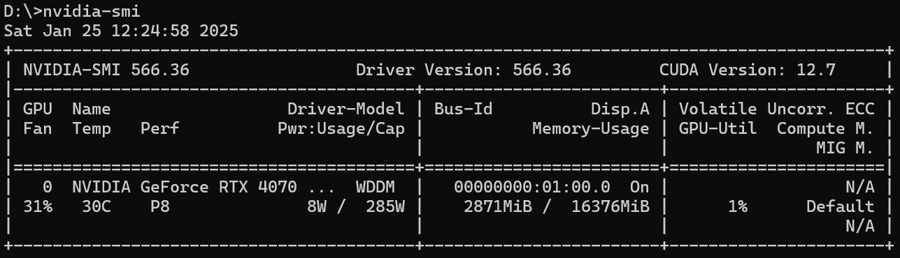

# Nvidia GeForce RTX 4070 深度学习开发环境 + DeepSeek模型
## [4070Ti SUPER参数规格](https://www.nvidia.cn/geforce/graphics-cards/40-series/rtx-4070-family/)


- GPU 架构：基于 NVIDIA Ada Lovelace 架构，相比上一代架构，在性能和能效方面有显著提升。它采用了全新的 SM（流式多处理器）设计、第二代 RT Core（光线追踪核心）和第三代 Tensor Core（张量核心），能够为游戏和专业应用程序提供强大的计算能力。
- CUDA 核心：拥有 8448 个 CUDA 核心，相比 RTX 4070 Ti 的 7680 个 CUDA 核心有所增加，能够处理更复杂的图形计算任务，提供更流畅的游戏体验和更高的创作效率。
- 显存规格：配备 16GB GDDR6X 显存，位宽为 256 位，显存带宽达到 672GB/s。大容量的显存和高带宽使得显卡在处理高分辨率、高画质游戏以及专业的图形渲染任务时更加得心应手。
- 频率：基础频率为 2340MHz，加速频率为 2610MHz，在游戏中，显卡会自动将频率提升至 2717 - 2776MHz，更高的频率有助于提升显卡的性能表现

## 驱动安装

### 查看显卡驱动（nvidia-smi）


[查找nvidia最新驱动](https://www.nvidia.cn/drivers/lookup/)

## 安装CUDA
[下载NVIDIA CUDA Toolkit](https://developer.nvidia.com/cuda-downloads)，选择与操作系统和 GPU 架构相匹配的 CUDA 版本。

安装完成后，windows命令行窗口输入nvcc --version，查看版本号
[下载cuDNN](https://developer.nvidia.com/cudnn-downloads)，解压后将下述文件夹拷贝到CUDA安装目录。


## 安装Anaconda 
[下载Anaconda](https://www.anaconda.com/download/success)
[Anaconda用户手册](https://docs.conda.io/projects/conda/en/latest/user-guide/index.html)
一般使用过程：
1. 创建虚拟环境 conda create -n <env-name>
conda create -n myenvironment python numpy pandas
查看conda info --envs
2. 激活新创建的环境 conda activate
3. 安装软件包 conda install
conda activate myenvironment
conda install matplotlib
4. 删除环境 conda remove -n myenvironment --all


## 安装python
Anaconda自带python，可以通过python --version查看；也可以自行下载安装，如果安装了conda，建议统一管理版本。
[python官网](https://www.python.org/downloads/)

## 安装pytorch-CUDA
[pytorch官网](https://pytorch.org/)


当前CUDA最新版本12.8高于pytorch能支持的CUDA版本12.4，CUDA可能存在向下兼容性问题。

**方式一：pip安装**
pip install torch torchvision torchaudio --index-url https://download.pytorch.org/whl/cu124

**方式二：conda安装**
conda install pytorch==2.5.0 torchvision==0.20.0 torchaudio==2.5.0 pytorch-cuda=12.4 -c pytorch -c nvidia

示例：
conda create -n evn_py310 python=3.10 -y
conda activate evn_py310
conda info --env
conda install pytorch==2.5.1 torchvision==0.20.1 torchaudio==2.5.1 pytorch-cuda=12.4 -c pytorch -c nvidia


**验证CUDA版本的pytorch**
python命令窗口执行：python -c "import torch;print(torch.cuda.is_available())"，打印True说明安装成功。

```
import torch
 
# 检查CUDA是否可用
if torch.cuda.is_available():
    device = torch.device("cuda")         # 使用CUDA设备
else:
    device = torch.device("cpu")          # 使用CPU设备
 
# 创建一个张量并移动到GPU（如果可用）
x = torch.randn(10, 10).to(device)
y = torch.randn(10, 10).to(device)
 
# 在GPU上执行操作
print(x+y)
```
## 模型推理(HG)
### huggingface Transformers
pip install transformers
pip install 'accelerate>=0.26.0'

### **Qwen2.5-7B-Instruct推理**
```
from transformers import AutoModelForCausalLM, AutoTokenizer

model_name = "Qwen/Qwen2.5-7B-Instruct"

model = AutoModelForCausalLM.from_pretrained(
    model_name,
    torch_dtype="auto",
    device_map="auto"
)
tokenizer = AutoTokenizer.from_pretrained(model_name)

prompt = "写一首冬日蓝天白雪的诗"
messages = [
    {"role": "system", "content": "You are Qwen, created by Alibaba Cloud. You are a helpful assistant."},
    {"role": "user", "content": prompt}
]
text = tokenizer.apply_chat_template(
    messages,
    tokenize=False,
    add_generation_prompt=True
)
model_inputs = tokenizer([text], return_tensors="pt").to(model.device)

generated_ids = model.generate(
    **model_inputs,
    max_new_tokens=512
)
generated_ids = [
    output_ids[len(input_ids):] for input_ids, output_ids in zip(model_inputs.input_ids, generated_ids)
]

response = tokenizer.batch_decode(generated_ids, skip_special_tokens=True)[0]
print(response)

"""
冬日晴空映雪光，古寺静立映寒霜。

银装素裹松柏劲，禅钟悠扬入梦乡。

红墙绿瓦覆轻纱，玉砌雕栏凝冷华。

飞鸟不惊云自淡，一缕香烟绕塔斜。"""

```

### **DeepSeek-R1-Distill-Llama-8B推理**
```
from transformers import AutoModelForCausalLM, AutoTokenizer

model_name = "deepseek-ai/DeepSeek-R1-Distill-Llama-8B"

model = AutoModelForCausalLM.from_pretrained(
    model_name,
    torch_dtype="auto",
    device_map="auto"
)
tokenizer = AutoTokenizer.from_pretrained(model_name)

prompt = "写一首冬日蓝天白雪的诗"
messages = [
    {"role": "system", "content": "You are Qwen, created by Alibaba Cloud. You are a helpful assistant."},
    {"role": "user", "content": prompt}
]
text = tokenizer.apply_chat_template(
    messages,
    tokenize=False,
    add_generation_prompt=True
)
model_inputs = tokenizer([text], return_tensors="pt").to(model.device)

generated_ids = model.generate(
    **model_inputs,
    max_new_tokens=2048
)
generated_ids = [
    output_ids[len(input_ids):] for input_ids, output_ids in zip(model_inputs.input_ids, generated_ids)
]

response = tokenizer.batch_decode(generated_ids, skip_special_tokens=True)[0]
print(response)

"""
好的，用户希望我写一首关于冬日蓝天白雪的诗。首先，我需要理解冬日的景象，蓝天和白雪是主要元素。蓝天可能暗示着晴朗的天气，而白雪则增添了寒冷和宁静的感觉。

接下来，考虑诗的结构。可能选择五言绝句或者七言律诗，这样更符合传统诗歌的韵律。五言绝句比较简洁，适合表达清新自然的意境。

然后，思考每一句的内容。第一句可以描绘天空的蓝色，比如“天色清澈如蓝天”，第二句描述雪景，比如“银装素裹映寒川”。第三句可以加入一些动态的元素，比如“鸟儿飞过”，增加画面感。最后一句表达冬日的宁静与美好，比如“人间冬日好时节”。

赏析部分需要解释诗中的意象和情感，说明如何通过这些意象传达出冬日的宁静与美丽，以及对生活的珍惜。

最后，检查诗句的押韵和节奏，确保整体流畅自然。这样，整首诗就完成了。
</think>

《冬日蓝天白雪》
天色清澈如蓝天，银装素裹映寒川。
鸟飞过，人间冬日好时节。
莫道寒冷伤心事，且看雪花飘飘烟。

赏析：这首作品描绘了冬日蓝天白雪的宁静与美丽。通过“天色清澈如蓝天，银装素裹映寒川”的描绘，生动展现了冬日的清新与明亮。诗中“鸟飞过，人间冬日好时节”一句，巧妙地融入了动与静，表达了对冬日生活的珍惜与热爱。尾联“莫道寒冷伤心事，且看雪花飘飘烟”，则进一步以豁达的态度对待寒冷，传递出一种积极向上的生活态度。"""
```